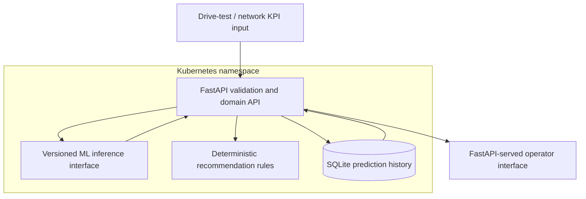

# Network Fault Intelligence Platform

Modernization foundation for the Master's thesis and Ericsson Algeria graduation project,
**“Self-healing and Fault Recognition based on Deep Learning in Wireless Networks.”** The
research workflow evaluates drive-test/mobile-network KPIs for 2G, 3G, and 4G sites, detects
faults, classifies probable causes, and presents deterministic troubleshooting actions and
historical site records.

The portfolio repository was reconstructed as a clean implementation, then the historical
Ericsson project artifacts and labeled validation dataset were recovered for investigation. The
original materials remain local and Git-ignored; the modern implementation keeps them separate
from the new training and inference pipeline.

## Current status

The backend provides validated KPI input, the modern ML inference service, rule-based
recommendations, health endpoints, and SQLite prediction history. The rebuilt models and fitted
scaler remain local and ignored by Git pending provenance review. `/v1/predictions` uses only the
new `.keras` models and persisted preprocessing artifact; missing or unloadable artifacts produce
a structured `503` rather than a fabricated result.

The repository includes a same-origin, dependency-free operator interface served by FastAPI.
The site exploration view plots only coordinates recorded in prediction history; it is not a live map. The modern FastAPI application includes username/password authentication with server-side SQLite sessions; the historical Flask implementation was not copied.

## Research workflow and ML contract

The documented original input features are Retainability, HOSR, RSRP, RSRQ, SINR, average
throughput, and mobile-station-to-site distance, plus cell, coordinates, and date. The API accepts
these features without imposing thesis KPI thresholds or fitting normalization against incoming
production requests.

The recovered taxonomy uses classes 1–6 for fault causes and class 7 for Normal. The modern binary
target is derived from that taxonomy: `FaultCause` 1–6 = Fault, 7 = Normal. The dataset has no
separate binary annotation. The modern pipeline uses a seven-feature `(batch, 1, 7)` LSTM input
contract and a `StandardScaler` fitted only on training rows. A persisted scaler is used for
inference; inference never fits preprocessing on incoming values.

Recommendations are deterministic rules, not AI or model output:

| Cause | Actions |
| --- | --- |
| ED — Excessive Downtilt | Check Bandwidth Capacity Configuration; Check Frequency Configuration; Check Tilt Configuration; Check Load Balance |
| EU — Excessive Uptilt | ED actions plus Check Synchronization of Cell |
| TLHO — Too Late HandOver | Check Handover Execution |
| II — Inter-System Interference | Check Planification of Sites; Check Frequency Configuration; Check Coverage |
| CH — Coverage Hole | Check Power Configuration; Check Cell Range; Check Tilt Configuration |
| RP — Reduction of Cell Power | Check if RRU is Faulty; Check Licence; Check Power on Site |
| Normal | No troubleshooting action |

## Modernized ML Pipeline

This project originated as an Ericsson internship and Master's project on self-healing and fault
recognition in wireless networks. The original system used LSTM models; its HDF5 files and source
findings were recovered as historical evidence. Those artifacts have compatibility and training
provenance limitations, so the model pipeline was rebuilt from scratch using modern Keras rather
than adapting the old HDF5 files for current inference.

Binary fault detection and multiclass fault-cause classification are separate models. The
deterministic `StratifiedGroupKFold` split keeps identical seven-feature vectors in one partition.
The saved preprocessing artifact contains the feature order and a scaler fitted on training data
only. The reusable inference layer validates named input features, loads that scaler and both
models, and does not refit preprocessing. FastAPI consumes this inference layer through
`POST /v1/predictions`; the original HDF5 artifacts are not part of this path.

On the recovered 1,137-row dataset, seed 42 produced 812 train, 162 validation, and 163 untouched
test rows, with no feature groups shared across splits. The validation audit measured 99.39%
multiclass test accuracy and 95.09% binary accuracy. The dataset's provenance relative to original
model development is unknown, so these results do not establish independent or field performance.
The API exposes binary/multiclass disagreements as `REVIEW_REQUIRED`, without inventing a fault
cause. Historical thesis numbers are not treated as the current benchmark.

Train locally with the isolated Python 3.13 environment after installing the ML extra:

```powershell
# Create once, if the ignored environment does not already exist.
py -3.13 -m venv .v313
.\.v313\Scripts\python.exe -m pip install -e ".[dev,ml]"
.\.v313\Scripts\python.exe -m app.ml.train --dataset .\db_fm_validation14.csv --seed 42 --epochs 150 --batch-size 32
```

The command writes `.keras` models, `preprocessing.joblib`, and `model_metadata.json` under
`models/`, plus metrics and a human-readable report under `artifacts/ml/`. Generated artifacts
remain ignored by Git pending review of Ericsson-derived information. The source dataset and
`artifacts/original/` remain ignored and untouched.

## Architecture



The current deployable workload is a single backend container. Inference remains an internal
backend interface; integrate the validated local models before deployment and measure load before
considering a separate service. The single-replica deployment stores prediction history and authentication data in SQLite. A multi-replica deployment requires shared relational history and session storage.

## Project layout

| Path | What it contains |
| --- | --- |
| `app/main.py` | FastAPI application, routes, and startup wiring |
| `app/auth.py`, `app/authorization.py` | Account storage, sessions, and role checks |
| `app/inference.py`, `app/ml/` | Model loading, request adaptation, dataset preparation, and training |
| `app/repository.py`, `app/investigations.py`, `app/network_health.py` | SQLite access for predictions, investigations, and network health runs |
| `app/ui/` | Same-origin operator interface (HTML, CSS, and JavaScript) |
| `migrations/` | Alembic schema changes |
| `tests/` | API, migration, authentication, investigation, and ML pipeline tests |
| `Dockerfile`, `k8s/` | Container image and Kubernetes manifests |
| `artifacts/`, `models/`, `data/` | Local generated outputs and runtime data; ignored by Git |

## API

FastAPI publishes OpenAPI and Swagger UI at `/docs` for authenticated `platform_ml_admin` users;
the schema also exposes privileged model response contracts and is not available to operators.

| Method and path | Purpose |
| --- | --- |
| `GET /health/live` | Process liveness |
| `GET /health/ready` | Database readiness and whether model/scaler artifacts loaded |
| `POST /v1/auth/login` | Verify credentials and issue an HTTP-only session cookie |
| `POST /v1/auth/logout` | Invalidate the current session |
| `GET /v1/auth/me` | Return current user or `401` |
| `POST /v1/predictions` | Authenticated: validate seven KPI features, return both predictions, apply consistency policy, record result |
| `POST /v1/recommendations` | Authenticated: return cause name and deterministic troubleshooting actions |
| `GET /v1/history?limit=100` | Authenticated: return recent prediction records |
| `GET /v1/ml/evaluation` | Platform/ML Admin: cause-classification metrics from verified investigations |
| `GET /v1/ml/verified-outcomes` | Platform/ML Admin: read-only evidence cases in the evaluation population |

## Modern UI

The operator interface is a small HTML, CSS, and vanilla JavaScript application under
`app/ui/`, served by FastAPI at `/` and `/assets`. Keeping it on the API origin avoids a separate
frontend service and CORS configuration. The frontend API client is centralized in
`app/ui/assets/app.js`; it calls `/health/live`, `/health/ready`, `POST /v1/predictions`, and
`GET /v1/history?limit=500`. No JavaScript package or map dependency is required.

The Overview metrics and recent detections are derived from real history rows. Network Sites
plots only recorded latitude/longitude values and lists each site's latest returned record; it
does not claim to be a map tile service. History supports text search, status filtering, and a
detail panel. Analyze submits the seven required KPIs and optional cell, coordinate, and date
context to the API. Probability outputs, final status, and recommendations are rendered from the
response; model disagreement remains `REVIEW_REQUIRED` and does not receive a final cause or
recommendations. System Status displays API liveness and readiness results.

Run the UI locally through the existing FastAPI development command:

```powershell
\.v313\Scripts\python.exe -m uvicorn app.main:app --reload
```

Open `http://127.0.0.1:8000/`. The UI uses same-origin API paths by default, so no API URL setting
or CORS configuration is needed. If hosting the static assets separately, proxy the API paths to
the FastAPI service; the API base is intentionally centralized in the `API` client in
`app/ui/assets/app.js`.

Frontend checks require no installation: use a JavaScript runtime's syntax checker on
`app/ui/assets/app.js` (for example, `node --check app/ui/assets/app.js`) and inspect the page via
the local FastAPI service. Python tests and lint remain the backend checks described below.

Required request fields are `retainability`, `hosr`, `rsrp`, `rsrq`, `sinr`,
`average_throughput`, and `distance`. Optional history context is `cell`, `latitude`, `longitude`,
and ISO `date`. Numeric inputs must be finite JSON numbers; coordinates are checked against
geographic bounds, without imposing uncertain radio KPI thresholds. Unknown fields are rejected.

The versioned response includes the binary fault probability and its explicit 0.5 decision
threshold, the multiclass winner and all seven probabilities, final status, and deterministic
recommendations. A mismatch between binary and multiclass fault-vs-normal decisions returns
`REVIEW_REQUIRED`, no final cause, and no recommendations. History stores input KPIs, both model
outputs, final status, timestamp, and model version.

## Local development

Requires Python 3.13 and the local model artifacts for ML prediction. Install the `ml` extra to
load TensorFlow and the preprocessing dependencies; without loadable artifacts the API stays alive
but readiness is degraded and predictions return `503`.

```powershell
py -3.13 -m venv .v313
.\.v313\Scripts\python.exe -m pip install -e ".[dev,ml]"
.\.v313\Scripts\python.exe -m uvicorn app.main:app --reload
```

The service listens on `http://127.0.0.1:8000`. Configuration uses `NFI_DATABASE_PATH`,
`NFI_MODEL_DIR`, and `NFI_LOG_LEVEL`; `.env` is ignored by Git. See FastAPI authentication below for the initial operator bootstrap settings.

## Docker

The Dockerfile and container configuration are implemented, and the UI files are included through
the existing `COPY app ./app` step. Docker image build and container runtime verification are
pending on this workstation because Docker is unavailable here. The
commands below describe how to build and run the image in an environment with Docker installed;
they are not evidence that these commands have already been executed.

Build the Python 3.13 image (TensorFlow and the current ML runtime are installed from the
`[ml]` extra in `pyproject.toml`):

```powershell
docker build -t network-fault-intelligence-platform:local .
```

The configured image runs as UID 10001 and contains no model artifacts or secrets. Models and
preprocessing are external runtime artifacts and are not included in this Git repository. To check
degraded mode in a Docker-enabled environment without mounting them:

```powershell
docker run -d --name nfi-no-models -p 8000:8000 `
  -e NFI_DATABASE_PATH=/app/data/nfi.sqlite3 `
  -v nfi-history:/app/data `
  network-fault-intelligence-platform:local
Invoke-RestMethod http://localhost:8000/health/live
Invoke-RestMethod http://localhost:8000/health/ready
```

The expected behavior is that readiness reports inference unavailable while liveness remains
available. Predictions return a structured `503` until the four current artifacts are supplied.
To run with local artifacts in `models/`, mount that directory read-only:

```powershell
$ModelPath = (Resolve-Path .\models).Path
docker run -d --name nfi-with-models -p 8000:8000 `
  -e NFI_MODEL_DIR=/app/models `
  -e NFI_DATABASE_PATH=/app/data/nfi.sqlite3 `
  -v nfi-history:/app/data `
  --mount "type=bind,source=$ModelPath,target=/app/models,readonly" `
  network-fault-intelligence-platform:local
Invoke-RestMethod http://localhost:8000/health/ready
Invoke-WebRequest http://localhost:8000/docs
Invoke-WebRequest http://localhost:8000/openapi.json
```

Submit a seven-feature request using Swagger UI at `http://localhost:8000/docs`. The model
directory must contain `binary_fault_detector.keras`, `fault_cause_classifier.keras`,
`preprocessing.joblib`, and `model_metadata.json`. No historical HDF5 model is used. Remove each
container with `docker rm -f nfi-no-models` or `docker rm -f nfi-with-models` when finished.

## Deployment

The repository implements this deployment path:

```text
FastAPI / ML application
        ↓
Docker containerization
        ↓
Kubernetes deployment manifests
```

The configuration includes health/readiness probes, resource requests and limits, non-root
execution, persistent storage, and externally supplied ML model artifacts. The Docker and
Kubernetes configurations are implemented in the repository. Runtime verification is pending
because the current corporate development workstation does not provide Docker or a local
Kubernetes runtime. The application has been verified through its existing test suite; Kubernetes
manifests have been statically inspected, but have not been deployed to a live cluster here.

## Kubernetes

Kubernetes is part of the modernized implementation; it was not used by the original Ericsson
Master's project. The manifests configure the FastAPI container in namespace `nfi`, with a
ClusterIP service, persistent PVCs for SQLite history and externally supplied model files, and
startup, liveness, and readiness probes. They specify one replica because SQLite and the
ReadWriteOnce volumes are not a multi-replica production persistence design. No Secret is needed
by the current application.

To deploy in an environment with `kubectl` and a Kubernetes cluster, first build the Docker image
as described above. Load the local image into the chosen cluster, for
example `kind load docker-image network-fault-intelligence-platform:local` or
`minikube image load network-fault-intelligence-platform:local`. Then inspect and apply:

```powershell
kubectl kustomize .\k8s
kubectl apply -k .\k8s
kubectl get pods,deployments,services,pvc -n nfi
```

The model PVC is configured to start empty, so the pod can be Running and live while remaining
unready. The optional `k8s/model-loader-pod.yaml` mounts that claim read/write for provisioning.
With the
modern artifacts in local `models/`, copy them and restart the application:

```powershell
kubectl apply -f .\k8s\model-loader-pod.yaml
kubectl wait --for=condition=Ready pod/nfi-model-loader -n nfi --timeout=120s
kubectl cp .\models\binary_fault_detector.keras nfi/nfi-model-loader:/app/models/binary_fault_detector.keras
kubectl cp .\models\fault_cause_classifier.keras nfi/nfi-model-loader:/app/models/fault_cause_classifier.keras
kubectl cp .\models\preprocessing.joblib nfi/nfi-model-loader:/app/models/preprocessing.joblib
kubectl cp .\models\model_metadata.json nfi/nfi-model-loader:/app/models/model_metadata.json
kubectl delete -f .\k8s\model-loader-pod.yaml
kubectl rollout restart deployment/network-fault-intelligence-platform -n nfi
kubectl rollout status deployment/network-fault-intelligence-platform -n nfi
```

The application mounts `/app/models` read-only. The probe checks the existing readiness
response's `inference` field because the API returns HTTP 200 with a degraded body when artifacts
are absent. Before copying the models, the pod should stay Running/live but show `0/1` Ready, and
`POST /v1/predictions` returns the API's structured 503. Port-forward and inspect health and
documentation:

```powershell
kubectl port-forward service/nfi-api 8000:8000 -n nfi
Invoke-RestMethod http://localhost:8000/health/live
Invoke-RestMethod http://localhost:8000/health/ready
Invoke-WebRequest http://localhost:8000/docs
Invoke-WebRequest http://localhost:8000/openapi.json
```

After deployment, submit a real recovered dataset sample through Swagger UI for prediction checks.
Alembic upgrades are applied by the existing application startup; no destructive downgrade or
database reset is performed. The SQLite PVC preserves history across pod replacement, but the one-replica,
ReadWriteOnce local setup is not high availability or a supported multi-node database design.
Initial CPU/memory requests and limits are conservative starting values and need tuning from
observed cluster usage. To remove the deployment, run `kubectl delete -k .\k8s`; this also deletes
the namespace and its PVCs, including local history and provisioned model copies.

## Data and security

The current SQLite table records prediction output, timestamp, and validated KPI payload for
history. SQLite is a development/single-instance choice, not a multi-replica database design.
Authentication, role-based access, retention controls, and privacy review remain prerequisites
before handling employee accounts or sensitive operational data. Logs include cell and request
identifiers only; do not add raw KPI payloads or credentials to logs.

## Tests and CI

```sh
python -m pip install -e ".[dev]"
ruff check .
pytest
docker build -t network-fault-intelligence-platform:local .
```

GitHub Actions is configured to run lint, behavior tests, a Docker build, and Kubernetes manifest
YAML parsing on pushes and pull requests. It does not deploy to production. Kubernetes YAML
parsing does not verify behavior on a live cluster; use cluster-specific policy validation before
production deployment.

## Limitations and next steps

The recovered dataset's provenance relative to original model training could not be established.
The grouped evaluation is a portfolio/research result on one recovered dataset, not evidence of
independent performance on live network traffic. Model and scaler files are intentionally ignored
by Git pending review of their provenance and suitability for publication. The modernized
Kubernetes deployment is intended for local demonstration, not production-scale operation.

## FastAPI authentication

The modernized application now includes a FastAPI username/password login flow. This is a new
implementation; the historical Ericsson application used Flask authentication. Passwords are
hashed with Argon2 via `pwdlib`. Random opaque session tokens are sent in an `HttpOnly` cookie;
only SHA-256 token digests and expiry timestamps are stored in the existing SQLite database.
The session lifetime defaults to eight hours. Sessions expire server-side and are removed when
expired sessions are encountered or new sessions are created.

`POST /v1/auth/login` accepts `username` and `password`, sets the session cookie, and returns
basic user details including the database-backed application role. `GET /v1/auth/me` returns the
current user or `401`. `POST /v1/auth/logout`
invalidates the current session and clears the cookie. `POST /v1/predictions`,
`GET /v1/history`, and `POST /v1/recommendations` require an active authenticated session.
`GET /health/live` and `GET /health/ready` remain public for container probes. There is no public
signup route.

The UI checks `/v1/auth/me` on startup, presents a matching NOC-style sign-in view when unauthenticated,
and shows the signed-in account and logout action in the application shell. Cookies use `SameSite=Lax`
and are `HttpOnly`; the local default does not set `Secure`, so `http://localhost:8000` works.
For HTTPS deployment set `NFI_COOKIE_SECURE=true`. Browser write endpoints also reject explicit
cross-origin requests; the same-origin UI requires no JavaScript-readable CSRF token. Keep the UI
and API on the same origin.

The application roles are `operator`, `network_admin`, and `platform_ml_admin`. Operators use the
Network Health and Network Sites views to investigate results, record findings, and submit cases
for review. Network administrators have a dedicated Investigation Queue and review page for
submitted cases; the queue excludes editable drafts and supports verified, unresolved, and unknown
outcomes through the existing verification workflow. The original predicted cause, investigator
proposal, and verified cause remain separate. Platform/ML administrators retain access to existing
privileged model/evaluation fields and API documentation. The Platform/ML Admin workspace includes
an overview, aggregate ML Evaluation, and a read-only Verified Outcomes evidence page. Verified
outcomes use the same eligibility rules as aggregate evaluation and preserve unknown model
provenance as unattributed. Training and model-management functions are not implemented.

Operators and network administrators receive operational statuses, predicted causes,
recommendations, and the seven input KPIs. Their prediction, history, and Network Health API
responses omit probabilities, classifier internals, model metadata, evaluation metrics, training
data, and ground-truth labels. Complete results remain stored in SQLite for the privileged API
projection. Roles are loaded from the user database row on every request; changing a role affects
existing sessions on the next request. The browser role display is for navigation and presentation;
the API enforces access.

For local setup, create an ignored `.env` with `NFI_BOOTSTRAP_USERNAME` and
`NFI_BOOTSTRAP_PASSWORD` set to a unique account, then start the API. The optional
`NFI_BOOTSTRAP_ROLE` defaults to `operator`. Set it to a privileged role only through trusted
server-side configuration when creating the initial account. Bootstrap never promotes or changes
an existing account; remove bootstrap credentials after initial creation. For an existing account,
role assignment requires controlled database administration, for example an authorized operator
can run `sqlite3 ./data/nfi.sqlite3 "UPDATE users SET role='platform_ml_admin' WHERE username='admin@example.test';"`.
The database constraint rejects values outside the three roles. There is no public role-assignment
endpoint. Relevant settings are:

| Variable | Default | Purpose |
| --- | --- | --- |
| `NFI_SESSION_TTL` | `28800` | Session lifetime in seconds |
| `NFI_COOKIE_SECURE` | `false` | Require HTTPS for the session cookie |
| `NFI_COOKIE_SAMESITE` | `lax` | Cookie SameSite policy |
| `NFI_BOOTSTRAP_USERNAME` | unset | Initial controlled account username/email |
| `NFI_BOOTSTRAP_PASSWORD` | unset | Initial password; never logged or stored in plaintext |
| `NFI_BOOTSTRAP_ROLE` | `operator` | Role for a newly created bootstrap account only |

The additive `0005_user_roles` Alembic migration adds a checked role column and assigns existing
users `operator`; it does not modify prediction history. Provide production credentials through a Kubernetes Secret (never a ConfigMap), and use a strong,
unique `NFI_BOOTSTRAP_PASSWORD`. TLS termination must be configured before enabling secure cookies.
Login throttling is not implemented in this phase; production deployment should apply lightweight
rate limiting at the ingress or reverse proxy. This is application authentication, not enterprise
SSO, OAuth, or a security certification.
